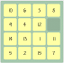
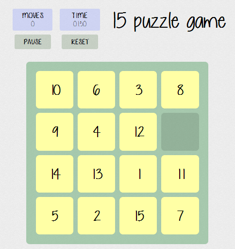

 15 Puzzle Game
=============

Move tiles in grid to order them from 1 to 15!

Play classic 15 Puzzle Game [here](http://lorecioni.github.io/15-puzzle-game-html5 "15 Puzzle Game").

Description
----------

The 15-puzzle (also called Gem Puzzle, Boss Puzzle, Game of Fifteen, Mystic Square and many others) is a sliding puzzle that consists of a frame of numbered square tiles in random order with one tile missing.

Screenshot
---------

  

License
-------

Copyright 2014 Lorenzo Cioni

License under MIT License, avaiable [here](LICENSE.txt "MIT License").